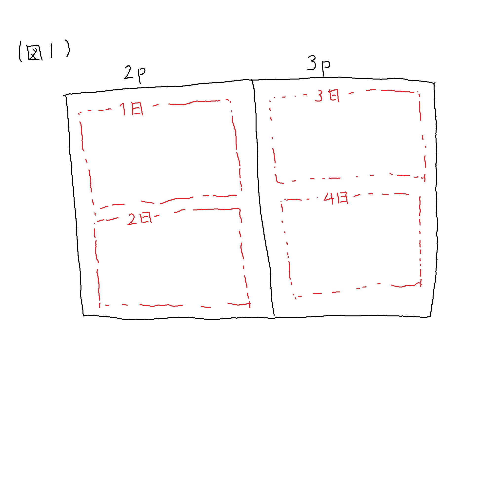

# 簡単な数による実験

## よくある勘違い

私たちは非常によく勘違いする問がある。 
私は今、資格取得のために問題集を解いている。 
1日に半ページ問題解ける位の難易度だ。 
45 ページから 60 ページまで勉強する場合、何日かかるかということを計算してスケジュールを立てたいと思っている。 
(60-45) × 2 = 30 日と算出してしまうケースが多い。 
では再度問題を変更して、難易度は変わらず、2ページから3ページとしてみよう。 
すると 以下の図1ように 4日かかることが分かる。 

さて上記の計算にあてはめると、(3-2)×2=2と算出されてしまい、計算が合わないことが分かる。 
引き算では差分を確認しているが、最初の1ページをカウントしないこととなるので、算出方法としては (3-2+1)×2となる。 
そのためもともとの問題は(60-45+1)*2=32 日と計算できる。 
ここで大切なことは数値を簡単にしてモデルを考え、検証するという考え方そのものである。 
