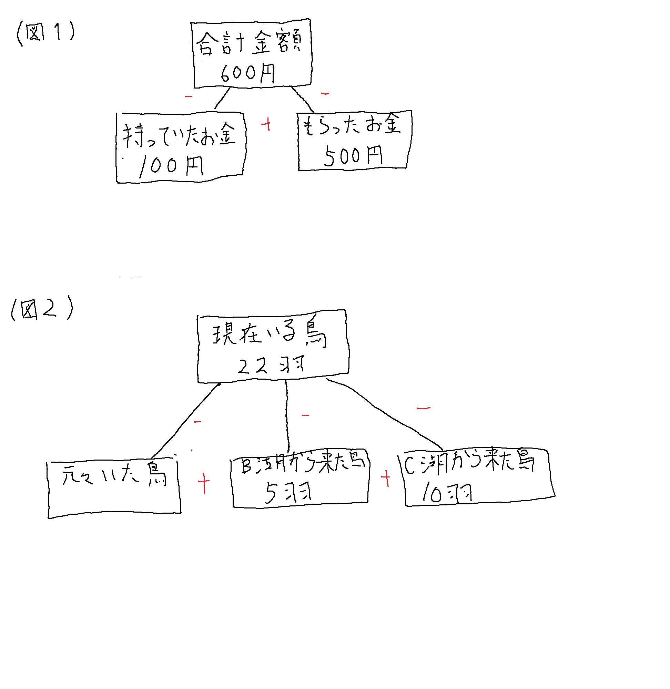

# 条件を図式化する

## 常に足し算とかけ算で考える
私が時々見ているサイトとしてカーンアカデミーというサイトがある。 
<https://www.khanacademy.org/> 
その中で足し算を図に表現していたので、一例を挙げてみる。 
(図1 に該当する問) 
ある子供が100円を持っている。その子供に親が500円をあげた場合、子供は600円持っていることになるが、そのことは以下の図1のように表現できる。 
親が何円あげたかということを計算する場合、それは 600-100=500 と計算することができるが、この図でいいたいことはシンプルに何と何を足せばよいかという足し算の関係だけで図式化することにより、引き算を使うべきかどうかすぐに見極めることができるという点にある。 
(図2 に該当する問)
Ａ 湖にはもともと何羽かの鳥がいた。そこに B 湖から 5 羽、 C 湖から 10 羽来た。現在いる鳥の数 22 羽だった場合、もともといた鳥の数を求めたいとする。そこで足し算のみで考えると、 
（もともといた鳥）+(B 湖から来た鳥)+(C 湖から来た鳥)=(現在いる鳥の数) 
となる。（もともといた鳥）は(現在いる鳥の数)から(B 湖から来た鳥)と(C 湖から来た鳥）を引けば求めることができることが分かった。 
かけ算についても同じように考えることができ、片割れを求める行為は割り算となる。 
引き算や割り算というのは現実世界の複雑な課題を考えるときに実は発想しにくい手法であることがあるため、足し算やかけ算により関係を整理した後に、計算として出てくるという捉え方も有効だと考える。 
多くの解決方法を知るとどれを選択すればよいか分からなくなることがある。 
図で情報を整理することで、混乱を防ぐことができるということを伝えたいと思う。 

